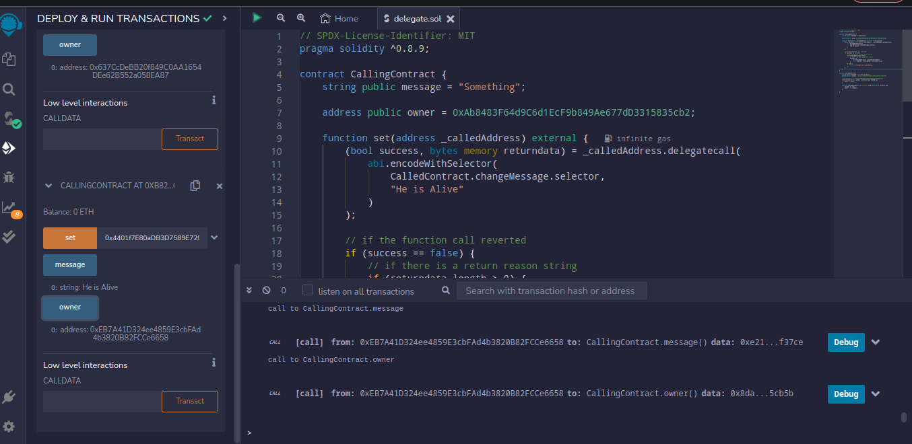

# Mastering Delegatecall in Solidity: A Comprehensive Guide with EVM Walkthrough

In this article, you will get a comprehensive overview of delegatecall in Solidity, how it works, and real-world examples of its use cases. We will also go through a step-by-step guide to using delegatecall with an EVM walkthrough, highlighting common pitfalls and how to avoid them. Without further ado, let’s begin.

### Prerequisite

Before delving further into this article, make sure you have an understanding of how solidity state variable storage layout works. If not make sure you check out solidity documentation on it [here](https://docs.soliditylang.org/en/v0.8.19/internals/layout_in_storage.html)

## What is Delegatecall?

In Solidity, delegatecall is a low-level function that allows a contract to delegate its call to another contract (borrowing the functionality of another contract) while still preserving its own storage and context. When a contract makes a delegatecall, the code at the target address is executed in the context of the calling contract. This means that the storage, state variables, and functions of the calling contract are accessible to the code being executed.

### To understand how delegatecall works better, let's consider the following scenario:

Let’s imagine that you’re a contractor👷 and you’ve been hired to build a house🏠. You’re responsible for coordinating with various other contractors who will be responsible for different aspects of the project, such as plumbing, electrical, carpentry, e.t.c.
<br/>
In this scenario, you are like the calling contract, and the other contractors are like the contracts that you will be calling using delegatecall.
<br/>
Now, imagine that you need the plumber to come in and install the pipes in the house. Instead of doing it yourself, you can use delegatecall to call the plumber and have him install the pipes for you. When you use delegatecall, the plumber comes to your worksite and installs the pipes in the context of your project rather than their own. This means that the plumber can access the tools, materials, and workers that you have available rather than having to bring their own. However, the plumber will still use their own expertise and knowledge to install the pipes correctly.
<br/>
Similarly, when you use delegatecall in a smart contract, you can call another contract and execute its code in the context of your own contract. This allows you to access your own storage, state variables, and functions while still being able to execute the code of the other contract.

## Difference Between Call and DelegateCall

Let’s pause for a moment and examine the distinction between utilizing call and delegatecall in Solidity. It is important to comprehend the disparity between these two, as it is vital for upgrading smart contracts.


call is a low-level Solidity function used to make an external call. When call is used, the target contract executes in its own context and any state changes it makes are confined to its own storage. call also returns a boolean value to indicate whether the call succeeded or not.
<br/>
<br/>
While delegatecall is similar to call, but instead of executing the target contract in its own context, it executes it in the context of the calling contract's current state as you can see in the diagram above. This means that any state changes made by the target contract are made to the calling contract's storage. This particular use case is of great significance when upgrading a contract, as it enables you to separate the contract's logic into multiple contracts without losing the original contract's state.
<br/>
<i>For example, suppose you have a contract that needs to be upgraded. You can create a new contract with the upgraded logic and use delegatecall to execute the new contract's code in the context of the original contract's storage. This way, the upgraded logic can access and modify the original contract's state as needed.</i>

### Things to note when using delegatecall

1. When a contract makes a delegatecall, the value of address(this), msg.sender, and msg.value do not change their values. However, it’s important to note that while the target contract can access the storage variables of the calling contract, it doesn’t inherit the original message call parameters of the calling contract. The original message call parameters include msg.sender, which is the address of the account that sent the original message call, and msg.value, which is the amount of Ether sent along with the message call, if any.
   <br/>
   <br/>
2. When a contract is called using delegatecall, the values of msg.senderand msg.valuepassed to the target contract are not those of the delegate call but instead those of the original message call to the calling contract. This means that the target contract can’t access the actual address of the account that sent the delegatecall or the amount of Ether sent with the delegate call.
   <br>
   <i>To illustrate this point, let’s say Contract A calls Contract B using delegatecall. If Contract B accesses msg.senderor msg.value, it will retrieve the values of the original message call to Contract A, not those of the delegate call from Contract A to Contract B. This is because delegatecall forwards the entire message (includingmsg.sender and msg.value) to the target contract but executes the called contract’s code in the context of the calling contract.</i>

3. When a function is executed with delegatecall, reads and writes to state variables do not happen to the contract that loads and executes the function i.e the target contract. Instead, the reads and writes happen to the contract that defines the function being executed(caller contract). This is because the execution context is that of the target contract, not the calling contract. So any changes made to state variables within the target function will happen to the storage of the target contract, not the calling contract.

<br/>
<i>e.g., When ContractA uses delegatecall to execute a function from ContractB, the execution context is still within ContractA. This means that any reads or writes to state variables within that context will be to the state variables of ContractA, not ContractB. ContractB’s state variables are effectively “hidden” from ContractA’s execution context and cannot be read or written to directly. However, ContractB’s functions can still access and modify its own state variables, as long as they are called directly (i.e. not through delegatecall) or through another contract that uses call instead of delegatecall.</i>

## How to use delegatecall with code example

In this code below, the CallingContract has the following;

- A state variable which is set to string “Something”
- A set function that takes an address \_calledAddress as an argument. This address should correspond to the TargetContract contract address. The set function then uses delegatecall to call the changeMessage function from the TargetContract, passing the argument "He is Alive" as a string when called.
- The changeMessage function of the TargetContract updates the message and owner state variables, and the changes are reflected in the CallingContract.
- If the delegatecall function fails, the set function will revert and return an error message. The error message will indicate if the function call reverted or if there was another error.

TargetContract which has the functionality to be implemented by the CallingContract using delegatecallhas the following;

- The contract has two state variables, message and owner, both declared as public, which means they can be accessed by anyone. The message variable is initialized with the string "I love solidity", while the owner variable is initialized with the value passed to the constructor when the contract is deployed.
- The constructor of the contract takes an argument \_owner, which is an address representing the owner of the contract. This argument is used to initialize the owner variable.
- The contract also has a function called changeMessage, which takes a string argument \_msg and updates the message and owner variables. The message variable is set to the value of \_msg, while the owner variable is set to the address of the function caller, which is obtained using msg.sender.

```solidity
// SPDX-License-Identifier: MIT
pragma solidity ^0.8.9;

contract CallingContract {
  string public message = "Something";

  address public owner = 0xAb8483F64d9C6d1EcF9b849Ae677dD3315835cb2;

  function set(address _calledAddress) external {
    (bool success, bytes memory returndata) = _calledAddress.delegatecall(
      abi.encodeWithSelector(
        TargetContract.changeMessage.selector,
        "He is Alive"
      )
    );

    // if the function call reverted
    if (success == false) {
      // if there is a return reason string
      if (returndata.length > 0) {
        // bubble up any reason for revert
        assembly {
          let returndata_size := mload(returndata)
          revert(add(32, returndata), returndata_size)
        }
      } else {
        revert("Function call reverted");
      }
    }
  }
}

contract TargetContract {
  string public message = "I love solidity";
  address public owner; //0x637CcDeBB20f849C0AA1654DEe62B552a058EA87

  //address(this) => 0x4401f7E80aDB3D7589E720e069CB7F81E0402550
  constructor(address _owner) {
    owner = _owner;
  }

  function changeMessage(string calldata _msg) external {
    message = _msg;
    owner = msg.sender;
  }
}
```

The TargetContract has the following when the changeMessage() is called with a new arguement;

- address(this) -> 0x4401f7E80aDB3D7589E720e069CB7F81E0402550
- msg.sender -> 0x637CcDeBB20f849C0AA1654DEe62B552a058EA87
- message(pass any string argument you want)-> “Just updated”
  <br/>
  Before the set() function in the CallingContract is being called, the contract has the following;

- address(this) -> 0xB82a6d6aAFbeB1d994604C119B97272Cba504F4F
- owner -> 0xAb8483F64d9C6d1EcF9b849Ae677dD3315835cb2
- message -> “Something”
  <br/>
  After the set() function in the CallingContract is being called, the contract has the following;

- address(this) -> 0xB82a6d6aAFbeB1d994604C119B97272Cba504F4F
- msg.sender -> 0xEB7A41D324ee4859E3cbFAd4b3820B82FCCe6658
- message -> “He is Alive”
  <br/>
  If you observe, the address(this) value didn’t change and also since the owner variable was assigned to the caller of the set() function which is the msg.sender, the CallingContract state variable gets updated with the current msg.senderin the context of the CallingContract and not the TargetContract.



The “owner” variable in theTargetContract still gives a value of 0x637CcDeBB20f849C0AA1654DEe62B552a058EA87, which is the same as the msg.senderthat deployed the TargetContract. When calling the “owner” variable in theCallingContract, it gives the value of the msg.sender who called the “set()” function, which is “0xEB7A41D324ee4859E3cbFAd4b3820B82FCCe6658” in this context.
Thus, all the requirements mentioned in “Things to note when using delegatecall” have been fulfilled.

## Common pitfalls to avoid when using delegatecall in Solidity

1. Using delegatecall to call an unknown or malicious contract: If you are using delegatecall to call a contract that you are not familiar with, there is a risk that the contract may behave maliciously or have vulnerabilities that could be exploited. Always make sure to thoroughly audit any contracts that you are calling with delegatecall.
   <br/>

2. Managing the state variable layout between the calling contract and the target contract: When a function is called with delegatecall, it operates in the context of the calling contract’s storage, meaning that it shares the same state variable address space(slot position). Therefore, it is important for the calling contract and the target contract to have the same state variable layout for any state variables that are read from or written to by both contracts. This ensures that both contracts access the same state variables in the same order, preventing issues such as overwriting or misinterpreting each other’s state variables. By having the same state variable layout, both contracts can access the same data in the same memory locations, regardless of their individual implementation details.
   <br/>

<i>For example let’s say that a ContractA declares state variables ‘string message;’ and ‘address owner;’ and ContractB declares state variables ‘uint256 num;’ and ‘address owner;’. They have different state variables at position 0 (‘string message’ and ‘uint256 num’) in contract storage and so they will write and read wrong data between them at position 0 if delegatecall is used between them.</i>

<br/>
<br/>
It is important to carefully plan and manage the state variable layout of contracts that use delegatecall to ensure that they are accessing the same data in the same memory locations. This can be achieved through strategies such as defining a shared interface or thoroughly communicating any changes to the state variable layout. To know more about using a shared storage for upgradeable contracts, check out my previous article on[Diamond Standard](https://medium.com/@ajaotosinserah/upgradable-functionality-with-eip2535-a-comparative-analysis-c9c1d9954296)
<br/>

3. Changing state variables in the calling contract: When using delegatecall, you need to be careful not to accidentally modify state variables in the calling contract. If the called function modifies state variables, those changes will be made to the calling contract's state instead of the target contract's state. Always make sure to use call instead of delegatecall if you need to modify state variables in the calling contract.
   <br/>

4. It’s important to note that if delegatecall is called on an address that is not a contract(EOA), and thus has no code, it will return a true status value. This behavior can cause bugs if the code expects delegatecall functions to return false when they cannot execute. To avoid this issue, it’s advisable to verify that any address variable used with delegatecall contains code before executing the function. If there is any uncertainty as to whether the address will always contain code, it's important to check before using delegatecall and revert the transaction if the address does not contain code. Here is an example of code that checks if an address has code:

```solidity
function hasCode(address _address) internal view returns (bool) {
  uint256 codeSize;
  assembly {
    codeSize := extcodesize(_address)
  }
  return codeSize > 0;
}

//This function uses the extcodesize opcode to check the size of the code at the given address.
//If the code size is greater than zero, then the address contains code and the function returns true.
// Otherwise, it returns false. By using this function to verify the presence of code at an address
// before using delegatecall, you can help prevent bugs and vulnerabilities in your code.
```

5. Misusing the return value: delegatecall returns a boolean value indicating whether the call was successful or not. However, the return value of the function being called is not automatically returned. This can lead to unexpected behavior if the return value is not handled properly. Always make sure to handle the return value of the function being called correctly.
   <br/>

6. Passing incorrect arguments: When using delegatecall, you need to ensure that the arguments being passed to the called function are correct. If the arguments are incorrect, the function being called may behave unexpectedly or even fail. Always make sure to pass the correct arguments to the function being called.
   <br/>
   <br/>
   To avoid these pitfalls, it’s important to thoroughly understand how delegatecall works and to use it judiciously. Make sure to test your code thoroughly and to audit any contracts that you are calling with delegatecall.

## EVM Walkthrough

In the following discussion, we will briefly review the opcodes used in the previous code example and provide an explanation of how delegatecall OPCODE is utilized, as well as the gas price.

```solidity
146 JUMP
147 JUMPDEST
148 PUSH1 40
150 MLOAD
151 PUSH2 0082
154 SWAP2
155 SWAP1
156 PUSH2 02a3
159 JUMP
160 JUMPDEST
161 PUSH1 40
163 DUP1
164 MLOAD
165 PUSH1 20
167 PUSH1 24
169 DUP3
170 ADD
171 DUP2
172 SWAP1
173 MSTORE
174 PUSH1 0b
176 PUSH1 44
178 DUP4
179 ADD
180 MSTORE
181 PUSH11 486520697320416c697665
193 PUSH1 a8
195 SHL
196 PUSH1 64
198 DUP1
199 DUP5
200 ADD
201 SWAP2
202 SWAP1
203 SWAP2
204 MSTORE
205 DUP4
206 MLOAD
207 DUP1
208 DUP5
209 SUB
210 SWAP1
211 SWAP2
212 ADD
213 DUP2
214 MSTORE
215 PUSH1 84
217 SWAP1
218 SWAP3
219 ADD
220 DUP4
221 MSTORE
222 DUP2
223 ADD
224 DUP1
225 MLOAD
226 PUSH1 01
228 PUSH1 01
230 PUSH1 e0
232 SHL
233 SUB
234 AND
235 PUSH4 60fd1c4f
240 PUSH1 e0
242 SHL
243 OR
244 SWAP1
245 MSTORE
246 SWAP1
247 MLOAD
248 PUSH1 00
251 DUP3
252 SWAP2
253 PUSH1 01
255 PUSH1 01
257 PUSH1 a0
259 SHL
260 SUB
261 DUP6
262 AND
263 SWAP2
264 PUSH2 0110
267 SWAP2
268 PUSH2 02d6
271 JUMP
272 JUMPDEST
273 PUSH1 00
275 PUSH1 40
277 MLOAD
278 DUP1
279 DUP4
280 SUB
281 DUP2
282 DUP6
283 GAS
284 DELEGATECALL
285 SWAP2
286 POP
287 POP
```

The OPCODES above represent the low-level instructions executed by the EVM when the set() function was called in the CallingContract contract. Here is a brief explanation of each opcode;
<br/>

- JUMP (opcode 146) : This opcode is used to implement control flow in the bytecode.
  <br/>
- PUSH1 (opcode 148, 161, 181, 215, and 273) and PUSH2 (opcode 151, 156, 267, and 268): These opcodes push a constant value onto the stack. The constant values are used for memory addresses and offsets in the bytecode.
  <br/>
- MLOAD (opcode 150 and 164) and MSTORE (opcode 173, 180, 213, and 221): These opcodes are used to read and write data from and to memory.
  <br/>
- SWAP1, SWAP2, SWAP3, and DUP1 (opcodes 154, 155, 172, 206, 207, 208, 212, 217, 222, 223, 225, 228, 229, 231, 252, 253, and 280): These opcodes are used to manipulate the stack.
  <br/>
- ADD (opcodes 169, 211, 213, 223, 260, and 262) and SUB (opcodes 209, 251, and 262): These opcodes are used to perform arithmetic operations.
  <br/>
- GAS (opcode 283): This opcode pushes all the available gas onto the stack. It is used to limit the amount of gas available for the delegatecall operation.
  <br/>
- DELEGATECALL (opcode 284): This opcode performs the actual delegatecall operation, transferring control to the called contract while preserving the calling contract's storage and executing in the calling contract's context.

## Gas Price

The gas price for a delegatecall opcode is calculated in the same way as for any other opcode in the Ethereum Virtual Machine (EVM). It is determined by the current gas price on the network multiplied by the gas limit for the transaction in which the delegatecall opcode is included.
<br/>
The gas price for a delegatecall opcode is the gas cost of executing the code in the target contract, plus any additional gas required for the delegatecall itself. This gas cost is deducted from the gas limit of the calling contract, and any remaining gas is returned to the calling contract after the delegatecall is complete.
<br/>
When using delegatecall, it is important to note that the gas cost is not only determined by the code being executed in the target contract, but also by the state of the calling contract. This means that if the state of the calling contract is complex, it may require more gas to execute the delegatecall opcode.
<br/>
Therefore, it is important to carefully manage gas costs when using delegatecall to avoid running out of gas during execution. This can be done by estimating the gas cost of the delegatecall beforehand, using gas-efficient code and storage layouts, and testing the delegatecall thoroughly in a test environment before deploying it to the main network.

### Conclusion

Delegatecall is a Solidity feature that allows contracts to execute code from other contracts while maintaining the calling contract’s storage and state. This article covered how delegatecall works, its benefits, and real-world use case. We also provided a step-by-step guide to using delegatecall and highlighted common pitfalls to avoid, including managing state variable layout, handling exceptions properly, and managing gas costs. By using delegatecall carefully, Solidity developers can increase code reuse and create more modular and flexible smart contracts. Thanks for reading!
